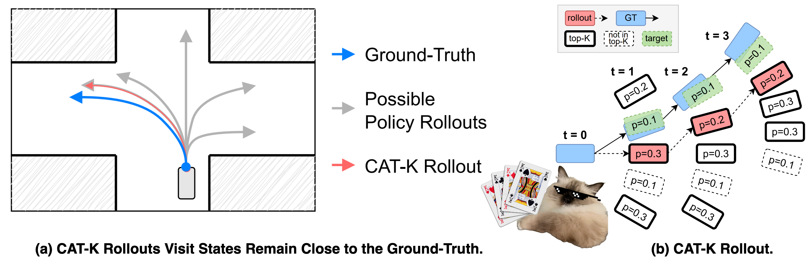

## Ascend训练环境
```
请参考昇腾社区中《Pytorch框架训练环境准备》文档搭建昇腾环境。
1. 激活 CANN 环境
将 CANN 包目录记作 cann_root_dir，执行以下命令以激活环境
source {cann_root_dir}/set_env.sh
2. 参考《Pytorch框架训练环境准备》安装 2.4.0 版本的 PyTorch 框架和 torch_npu 插件。
conda create -n catk python=3.10
conda activate catk
pip install torch-2.4.0.xxxxxxxxx.whl
pip install torch_npu-2.4.0.xxxxxxxxx.whl
3. 安装 DrivingSDK 加速库，安装方法参考官方文档。
4. 安装torch_scatter
torch_scatter、torch_cluster、torch_geometric均需要实现mxdriving算子修改，再进行编译。
git clone https://github.com/rusty1s/pytorch_scatter.git
cd pytorch_scatter
git apply ../patch/scatter.patch
5. 安装torch_cluster
git clone https://github.com/rusty1s/pytorch_cluster.git 
cd pytorch_cluster
git apply ../patch/cluster.patch
6. 安装torch_geometric
git clone https://github.com/pyg-team/pytorch_geometric.git
cd pytorch_geometric
git apply ../patch/geometric.patch
7. 拉取源代码
git clone https://github.com/NVlabs/catk.git
cd catk
conda install -y -c conda-forge ffmpeg=4.3.2
pip install -r install/requirements.txt
git apply ../patch/catk.patch
开始训练
1. 预处理
下载Waymo Open Motion 数据集。
使用scripts/cache_womd.sh将数据集预处理成 pickle 文件，以加快训练和评估期间的数据加载速度。
修改config文件和scripts文件。
bash scripts/cache_womd.sh
三个数据集：training，validation和testing
2. 训练
scripts/train.sh用于训练和微调。
使用scripts/train.sh和BC pre-training config来预训练 SMART-tiny 7M 模型。
使用scripts/train.sh和CLSFT with CAT-K config来微调在步骤 1 中预训练的 SMART-tiny 模型。
修改config文件和scripts文件，开始训练
bash scripts/train.sh
```

# Closed-Loop Supervised Fine-Tuning of Tokenized Traffic Models


<p align="center">
     
     <br/><strong>Closest Among Top-K (CAT-K) Rollouts</strong> unroll the policy during fine-tuning in a way that visited states remain close to the ground-truth (GT). At each time step, CAT-K first takes the top-K most likely action tokens according to the policy, then chooses the one leading to the state closest to the GT. As a result, CAT-K rollouts follow the mode of the GT (e.g., turning left), while random or top-K rollouts can lead to large deviations (e.g., going straight or right). Since the policy is essentially trained to minimize the distance between the rollout states and the GT states, the GT-based supervision remains effective for CAT-K rollouts, but not for random or top-K rollouts.
</p>

> **Closed-Loop Supervised Fine-Tuning of Tokenized Traffic Models**            
> [Zhejun Zhang](https://zhejz.github.io/), [Peter Karkus](https://karkus.tilda.ws/), [Maximilian Igl](https://maximilianigl.com/), [Wenhao Ding](https://wenhao.pub/), [Yuxiao Chen](https://research.nvidia.com/labs/avg/author/yuxiao-chen/), [Boris Ivanovic](https://www.borisivanovic.com/) and [Marco Pavone](https://web.stanford.edu/~pavone/index.html).<br/>
> 
> [Project Page](https://zhejz.github.io/catk)<br/>
> [arXiv Paper](https://arxiv.org/abs/2412.05334)

```bibtex
@inproceedings{zhang2025closed,
  title = {Closed-Loop Supervised Fine-Tuning of Tokenized Traffic Models},
  author = {Zhang, Zhejun and Karkus, Peter and Igl, Maximilian and Ding, Wenhao and Chen, Yuxiao and Ivanovic, Boris and Pavone, Marco},
  booktitle = {Proceedings of the IEEE Conference on Computer Vision and Pattern Recognition (CVPR)},
  year = {2025},
}
```

## News & Updates

Apr. 2025
- **Oral at CVPR 2025**: Cheers!
- **Top on the WOSAC Leaderboard 2024**: With the Waymo Challenges 2025 coming up, the WOSAC 2024 leaderboard is now closed and our method remains in the 1st place.

Feb. 2025
- **Paper accepted at CVPR 2025:** Cheers!

- **Model checkpoints for WOSAC:** You can obtain the checkpoints for our WOSAC submission (SMART-tiny-CLSFT) by sending an email to Zhejun (zhejun.zhang94@gmail.com). In accordance with Waymo's terms, you must attach a screenshot showing that you are registered and logged into the [My Submissions](https://waymo.com/open/challenges/submissions) page of the Waymo Open Dataset.

- **SMART-mini and SMART-nano:** SMART-tiny with 7M parameters requires training on 8x A100 for a few days, which may be unaffordable in some cases. To address this, we have added config files for two smaller model, [smart_mini_3M.yaml](configs/model/smart_mini_3M.yaml) and [smart_nano_1M.yaml](configs/model/smart_nano_1M.yaml). Specifically, SMART-nano-1M can be trained on a single A100, but its performance is significantly worse. After pre-training and CAT-K fine-tuning, we achieved an RMM of 0.74 with SMART-nano-1M, which is 0.03 lower than that of SMART-tiny-7M. 

Jan. 2025
- **SoTA performance on WOSAC:** CAT-K is now rank #1 on the [WOSAC leaderboard](https://waymo.com/open/challenges/2024/sim-agents/)! We resolved an issue in the agent token vocabulary, and now our fine-tuned model achieves an RMM of **0.7702**. Even our reproduced SMART-tiny-7M (not published on the leaderboard, trained only for 32 epochs via BC) achieves an RMM of **0.7671**, which is comparable to the current second-place method. Reproducing our results should be straightforward. Give it a try!

- **Issue in the agent token vocabulary:** We discovered that the [agent token vocabulary file](src/smart/tokens/cluster_frame_5_2048_remove_duplicate.pkl) we were using (borrowed from the [SMART repository](https://github.com/rainmaker22/SMART/blob/main/smart/tokens/cluster_frame_5_2048.pkl)) was intended only for sanity checks and not for reproducing optimal performance. To resolve this, we added a [script](src/smart/tokens/traj_clustering.py) and used it to build an [appropriate agent token vocabulary](src/smart/tokens/agent_vocab_555_s2.pkl). Our script is based on the [k-disk clustering script from SMART](https://github.com/rainmaker22/SMART/blob/main/scripts/traj_clstering.py). Thanks to the updated agent tokens, all our traffic simulation models saw a significant performance improvement of approximately +0.0060 RMM!


## Installation
- The easy way to setup the environment is to create a [conda](https://docs.conda.io/en/latest/miniconda.html) environment using the following commands
  ```
  conda create -y -n catk python=3.11.9
  conda activate catk
  conda install -y -c conda-forge ffmpeg=4.3.2
  pip install -r install/requirements.txt
  pip install torch_geometric
  pip install torch_scatter torch_cluster -f https://data.pyg.org/whl/torch-2.4.0+cu121.html
  pip install --no-deps waymo-open-dataset-tf-2-12-0==1.6.4
  ```
- Alternatively, a better way is to use the [Dockerfile](install/Dockerfile) and build your own docker. We found the code runs faster in the docker for some reasons.
- We use [WandB](https://wandb.ai/) for logging. You can register an account for free.
- **Be aware**
  - We use 8 *NVIDIA A100 (80GB)* for training and validation, the training and fine-tuning take a few days, whereas the validation and testing take a few hours.
  - We cannot share pre-trained models according to the [terms](https://waymo.com/open/terms) of the Waymo Open Motion Dataset.


## Dataset preparation
- Download the [Waymo Open Motion Dataset](https://waymo.com/open/download/). We use v1.2.1.
- Use [scripts/cache_womd.sh](scripts/cache_womd.sh) to preprocess the dataset into pickle files to accelerate data loading during the training and evaluation.
- You should pack three datasets: `training`, `validation` and `testing`.

## Run the code
In the scripts, we provide
- [scripts/train.sh](scripts/train.sh) for training and fine-tuning.
- [scripts/local_val.sh](scripts/local_val.sh) for local validation.
- [scripts/wosac_sub.sh](scripts/wosac_sub.sh) for packing submission files.

The default script runs with single GPU. We use DDP for multi GPU training and validation, and the codes are also found in the bash scripts.
To reproduce our final results, you should follow the following steps
1. Use [scripts/train.sh](scripts/train.sh) with the [BC pre-training config](configs/experiment/pre_bc.yaml) to pre-train the SMART-tiny 7M model.
2. Use [scripts/train.sh](scripts/train.sh) with the [CLSFT with CAT-K config](configs/experiment/clsft.yaml) to fine-tune the SMART-tiny model pre-trained in step 1.
3. Use [scripts/wosac_sub.sh](scripts/wosac_sub.sh) to pack the submission fille for `validate` or `test` split. Upload the `wosac_submission.tar.gz` file located in `logs` folder to the [WOSAC leaderboard](https://waymo.com/open/challenges/2024/sim-agents/) such that you can evaluate the model fine-tuned in step 2 on the WOSAC leaderboard.
4. Alternatively, you can do local validation with [scripts/local_val.sh](scripts/local_val.sh).

For Gaussian Mixture Model (GMM) based ego policy, the procedure is similar, just use the following configs
- [BC pre-training config for GMM-based ego policy](configs/experiment/ego_gmm_pre_bc.yaml)
- [CLSFT with CAT-K config for GMM-based ego policy](configs/experiment/ego_gmm_clsft.yaml)
- [Local validation config for GMM-based ego policy](configs/experiment/ego_gmm_local_val.yaml)
- There is no submission option for ego-policy.

## Performance

The submission of our CAT-K fine-tuned SMART to the [WOSAC Leaderboard](https://waymo.com/open/challenges/2024/sim-agents/) is found [here](https://waymo.com/open/challenges/sim-agents/results/5ea7a3eb-7337/1731338655639000/).
The submission of our reproduced SMART to the test split is found [here](https://waymo.com/open/challenges/sim-agents/results/5ea7a3eb-7337/1731391949275000/), note that it is not published to the leaderboard.

## Ablation configs

Please refer to [docs/ablation_models.md](docs/ablation_models.md) for the configurations of ablation models.
Specifically you will find the data augmentation methods used by [SMART](https://arxiv.org/abs/2207.05844) and [Trajeglish](https://arxiv.org/abs/2312.04535).

## Acknowledgement

Our code is based on [SMART](https://github.com/rainmaker22/SMART). We appreciate them for the valuable open-source code! Please don't forget to cite their amazing work as well!
